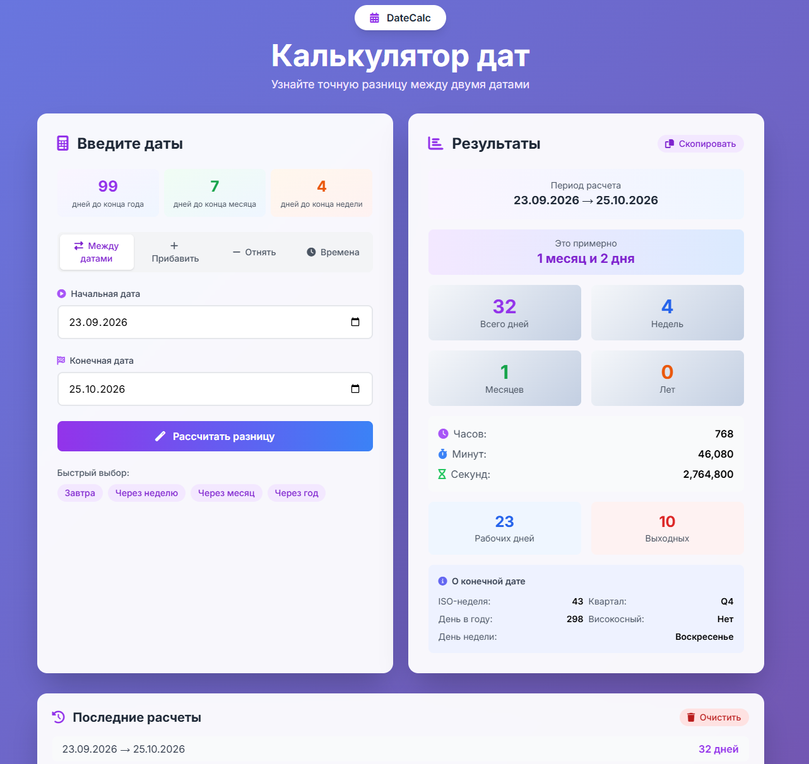

# DateCalc — калькулятор дат


Веб-приложение на Laravel для расчёта разницы между датами и временем.

## Возможности

- **Четыре режима расчёта:**
  - «Между датами» — разница между двумя датами
  - «Прибавить к дате» — прибавить дни, недели, месяцы или годы
  - «Отнять от даты» — отнять дни, недели, месяцы или годы
  - «Времена» — разница между двумя временами (например, 14:30 → 19:45)
- **Подробная разбивка результата:** дни, недели, месяцы, годы, часы, минуты, секунды
- **Человекочитаемая разница:** «Это примерно 30 лет и 2 месяца»
- **О конечной дате:** ISO-неделя, квартал, день в году, високосный ли год, день недели
- **Виджет «Сколько осталось»:** дней до конца года / месяца / недели
- **Подсчёт рабочих и выходных дней** за выбранный период
- **Быстрые кнопки:** «Завтра», «Через неделю», «Через месяц», «Через год»
- **История последних 5 расчётов** — хранится в БД
- **Кнопка «Скопировать результат»** — кладёт всё в буфер обмена одним кликом
- **Очистка истории** с подтверждением в кастомной модалке
- **Валидация** на сервере с русскими сообщениями об ошибках
- **Сохранение введённых дат** после отправки формы
- **Адаптивный дизайн** на Tailwind CSS

## Стек

- **Laravel 13** — фреймворк
- **PHP 8.5**
- **Carbon** — работа с датами
- **SQLite** — база данных по умолчанию
- **Tailwind CSS** (CDN) — стили
- **Font Awesome** (CDN) — иконки

## Установка

```bash
# 1. Клонировать репозиторий
git clone https://github.com/zipyal/date-calculator.git
cd date-calculator

# 2. Установить PHP-зависимости
composer install

# 3. Скопировать .env
cp .env.example .env

# 4. Сгенерировать ключ приложения
php artisan key:generate

# 5. Создать БД SQLite и выполнить миграции
touch database/database.sqlite
php artisan migrate

# 6. Запустить сервер
php artisan serve